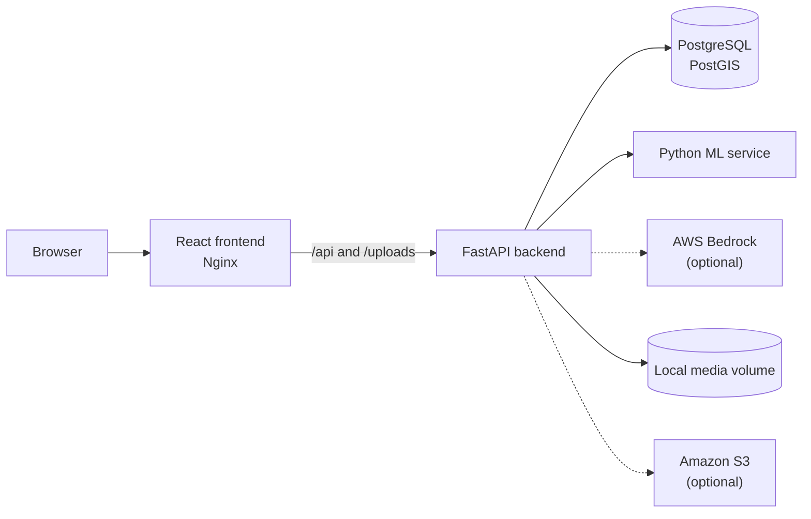

# Tat-Sahayk

Tat-Sahayk is a full-stack coastal-hazard reporting and decision-support
prototype. Citizens can submit geolocated reports with images, review
nearby activity, and confirm reports. Administrators can verify reports,
publish alerts, and manage response resources from map and dashboard
views.

The project is local-first: it runs with the included Python ML service
without requiring AWS. Bedrock and S3 can be enabled independently when
cloud-backed analysis or media storage is needed.

> Tat-Sahayk is a prototype and decision-support tool. Automated scores
> require human review and must not be treated as an official emergency
> warning.

## Current capabilities

- Citizen and administrator authentication with JWTs
- Optional Google OAuth login
- Public citizen signup with administrator self-registration blocked
- Secure operator-managed administrator provisioning
- Geolocated coastal-hazard reports with validated image uploads
- Report comments, confirmations, filters, status, and severity
- Interactive Leaflet map with reports, hotspots, shelters, response
  deployments, forces, and annotations
- Administrator verification workflow and dashboard
- Local, Bedrock, and hybrid AI analysis modes
- Configurable local-volume or S3 media storage
- PostgreSQL/PostGIS persistence with versioned Alembic migrations
- Health/readiness endpoints for all containerized services
- Development and production Docker Compose configurations
- Automated backend, ML, frontend, migration, dependency-audit, and
  production-policy checks in GitHub Actions

## Architecture



Development Compose publishes all four services for inspection.
Production Compose publishes only the Nginx frontend; the backend,
database, and ML service stay on the internal Compose network.

## AI provider modes

Set `AI_PROVIDER` and `AI_FALLBACK_ENABLED` in the root environment
file:

| Configuration | Behavior |
| --- | --- |
| `local`, fallback disabled | Use only the included ML service. |
| `local`, fallback enabled | Use local ML first and Bedrock if local analysis fails. |
| `bedrock`, fallback disabled | Use only Bedrock. |
| `bedrock`, fallback enabled | Use Bedrock first and local ML if Bedrock fails. |
| `hybrid` | Run both providers and combine available results. |

Bedrock-backed modes require `AWS_ENABLED=true` and suitable AWS
credentials or an IAM role. Hybrid scoring currently weights local ML
at 45% and Bedrock at 55%. If only one hybrid provider is available,
the result is explicitly marked as partial.

The local analysis service includes:

- keyword-based detection for tsunami, cyclone, storm surge, high
  waves, coastal erosion, coastal flooding, and no-hazard text
- VADER sentiment and urgency analysis
- spaCy named-entity extraction
- evidence-based citizen-report credibility scoring
- zero-shot CLIP image classification
- geospatial hotspot analysis
- optional external ocean/weather verification

No production accuracy, throughput, or latency benchmark is claimed by
this repository.

## Technology stack

| Layer | Main technologies |
| --- | --- |
| Frontend | React 19, Vite 7, React Router 8, TanStack Query 5, Tailwind CSS 3, DaisyUI 4, Leaflet |
| Backend | Python 3.11, FastAPI, SQLAlchemy 2, Alembic, Pydantic 2, JWT authentication, APScheduler |
| Data | PostgreSQL 16 with PostGIS |
| Local ML | Python 3.10, PyTorch, Transformers/CLIP, spaCy, NLTK/VADER, pandas, scikit-learn |
| Optional AWS | Bedrock analysis and S3 media storage |
| Operations | Docker Compose, Nginx, GitHub Actions |

## Quick start with Docker

### Prerequisites

- Docker Engine or Docker Desktop
- Docker Compose v2
- Git

### Start the complete development stack

```bash
git clone https://github.com/Hardikgupta1709/Tat-Sahayk.git
cd Tat-Sahayk

cp .env.example .env

docker compose config --quiet
docker compose up --build -d
docker compose ps
```

The first ML image build and startup can take longer because its model
and NLP dependencies are downloaded and initialized.

### Local URLs

| Service | URL |
| --- | --- |
| Frontend | http://localhost:8080 |
| Backend OpenAPI | http://localhost:5001/docs |
| Backend readiness | http://localhost:5001/health/ready |
| ML OpenAPI | http://localhost:8000/docs |
| ML health | http://localhost:8000/health |
| PostgreSQL/PostGIS | `localhost:5432` |

Verify the running stack:

```bash
curl --fail http://localhost:8080/health
curl --fail http://localhost:5001/health/ready
curl --fail http://localhost:8000/health
```

Follow logs:

```bash
docker compose logs --follow --tail=200
```

Stop containers while preserving named volumes:

```bash
docker compose down
```

## Accounts and administrator provisioning

Public signup creates citizen accounts only. Administrator accounts
must be provisioned by an operator.

With the development stack running, create a district administrator:

```bash
docker compose exec backend \
  python scripts/create_admin.py \
  --email admin@agency.gov.in \
  --full-name "District Administrator" \
  --district "Mumbai" \
  --state "Maharashtra"
```

Create a national administrator:

```bash
docker compose exec backend \
  python scripts/create_admin.py \
  --email national-admin@agency.gov.in \
  --full-name "National Administrator" \
  --national
```

The script prompts securely for a strong password and never prints it.
It refuses to change an existing account unless
`--update-existing` is supplied explicitly.

Production provisioning commands and operational guidance are in
[DEPLOYMENT.md](DEPLOYMENT.md).

## Configuration

Use the root environment examples:

- `.env.example` for development Compose
- `.env.production.example` for production Compose

Important settings:

| Variable | Purpose |
| --- | --- |
| `SECRET_KEY` | JWT signing secret |
| `POSTGRES_DB`, `POSTGRES_USER`, `POSTGRES_PASSWORD` | Development Compose database |
| `DATABASE_URL` | Production backend database connection |
| `AI_PROVIDER` | `local`, `bedrock`, or `hybrid` |
| `AI_FALLBACK_ENABLED` | Enables fallback for `local` or `bedrock` primary mode |
| `AWS_ENABLED`, `AWS_REGION` | Enables AWS-backed features |
| `AWS_BEDROCK_MODEL_ID` | Bedrock multimodal model |
| `MEDIA_STORAGE_PROVIDER` | `local` or `s3` |
| `S3_BUCKET` | Required for S3 media storage |
| `GOOGLE_CLIENT_ID` | Google OAuth web client ID |
| `MEDIA_MAX_FILE_SIZE_MB` | Per-file upload limit |
| `ENABLE_SOCIAL_HARVESTER` | Enables the optional scheduled feed harvester |
| `ENABLE_CLUSTER_ANALYSIS` | Enables optional scheduled cluster analysis |

Local development works with the default local provider and does not
require AWS credentials.

Do not commit `.env`, `.env.production`, access keys, OAuth secrets, or
real production credentials.

## Development workflows

### Frontend with Vite

Keep the backend services running through Compose, then run:

```bash
cd frontend
npm ci
npm run dev
```

Vite serves the frontend at `http://localhost:5173` and proxies
`/api` and `/uploads` to the backend on port 5001.

### Database migrations

The backend applies migrations automatically when its container
starts.

Inspect migration state:

```bash
docker compose exec backend alembic current
docker compose exec backend alembic check
```

Create a migration after changing SQLAlchemy models:

```bash
docker compose exec backend \
  alembic revision --autogenerate -m "describe the schema change"
```

Review every generated migration before applying it.

## Tests and validation

Run the complete backend suite:

```bash
docker compose exec backend python -m pytest -q
```

Run the lightweight ML scoring suite:

```bash
docker compose exec ml-service \
  pytest -q tests/test_credibility_scorer.py
```

Run integration smoke tests:

```bash
docker compose exec backend python scripts/test_ai_provider.py
docker compose exec backend python scripts/test_report_workflow.py
```

Run frontend checks:

```bash
cd frontend
npm run lint
npm run build
npm audit --omit=dev
```

Validate the committed production example:

```bash
python3 scripts/validate_production_compose.py \
  --env-file .env.production.example \
  --allow-example-secrets
```

For a real production environment, use `.env.production` and omit
`--allow-example-secrets`.

## API overview

Interactive OpenAPI documentation is authoritative:

- Backend: http://localhost:5001/docs
- ML service: http://localhost:8000/docs

Selected backend routes:

| Route | Purpose |
| --- | --- |
| `POST /api/v1/auth/signup` | Register a citizen |
| `POST /api/v1/auth/login` | Citizen login |
| `POST /api/v1/auth/admin-login` | Administrator login |
| `POST /api/v1/auth/google` | Google credential login |
| `GET/PATCH /api/v1/auth/me` | Read or update the current user |
| `GET/POST /api/v1/reports/` | List or create reports |
| `GET /api/v1/reports/my` | List the current user's reports |
| `PATCH /api/v1/reports/{id}/verify` | Administrator verification |
| `POST /api/v1/reports/{id}/confirm` | Toggle citizen confirmation |
| `POST /api/v1/media/upload-many` | Authenticated image upload |
| `GET/POST /api/v1/alerts/` | Read alerts or create one as an administrator |
| `/api/v1/map/*` | Map data and response-resource management |

Selected ML routes:

| Route | Purpose |
| --- | --- |
| `POST /api/v1/analyze/text` | Analyze one text |
| `POST /api/v1/analyze/batch` | Analyze multiple texts |
| `POST /api/v1/analyze/report` | Complete report and credibility analysis |
| `POST /api/v1/analyze/image` | Zero-shot image analysis |
| `POST /api/v1/analyze/multimodal` | Combined text and image analysis |
| `POST /api/v1/hotspots/detect` | Detect geospatial hotspots |
| `POST /api/v1/verify/report` | External ocean/weather verification |
| `GET /api/v1/models/info` | Loaded-model metadata |

## Repository structure

```text
Tat-Sahayk/
├── backend/
│   ├── alembic/                 # Versioned database migrations
│   ├── app/
│   │   ├── api/                 # Health and API routes
│   │   ├── core/                # Configuration and security
│   │   ├── crud/                # Database operations
│   │   ├── models/              # SQLAlchemy models
│   │   ├── schemas/             # Pydantic schemas
│   │   └── services/            # AI, storage, alerts, and geocoding
│   ├── scripts/                 # Startup, provisioning, and smoke tests
│   └── tests/
├── frontend/
│   ├── src/components/
│   ├── src/pages/
│   ├── src/lib/
│   ├── Dockerfile
│   └── nginx.conf
├── ml-service/
│   ├── src/analytics/
│   ├── src/api/
│   ├── src/external/
│   ├── src/inference/
│   ├── src/models/
│   └── tests/
├── scripts/
│   └── validate_production_compose.py
├── docker-compose.yml
├── docker-compose.production.yml
└── DEPLOYMENT.md
```

## Prototype boundaries

- AI and credibility output is advisory and requires administrator
  review.
- The local text hazard detector currently uses transparent keyword
  patterns rather than a trained transformer classifier.
- Image classification downloads and runs the CLIP model and may be
  resource intensive on CPU-only hosts.
- External weather, ocean-data, OAuth, notification, Bedrock, and S3
  behavior depends on separately configured provider credentials.
- Production TLS termination, monitoring, and off-host backup storage
  are infrastructure responsibilities outside the application Compose
  file.
- Automated tests cover core contracts and provider logic, but they
  are not a substitute for load, accessibility, security, or
  disaster-recovery testing.

## Contributing

1. Create a focused branch.
2. Keep credentials and generated artifacts out of commits.
3. Add or update tests with behavior changes.
4. Run backend, ML, frontend, and production-policy checks.
5. Submit a pull request with validation evidence.

## Team

- ML service: Hardik Gupta
- Backend: Aadesh Chaudhari
- Frontend: Priyal Khandal

Tat-Sahayk was created as a collaborative hackathon prototype for
coastal-community reporting and response coordination.
